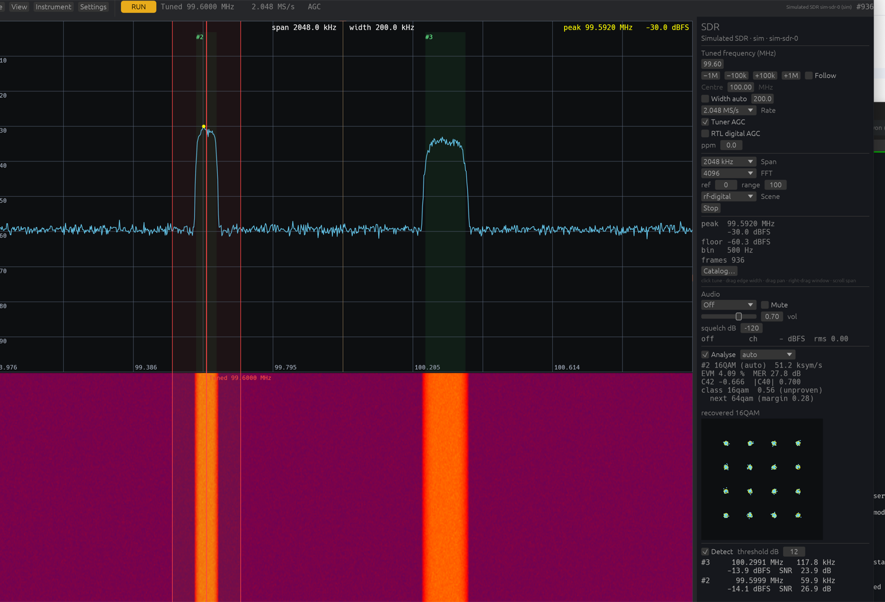
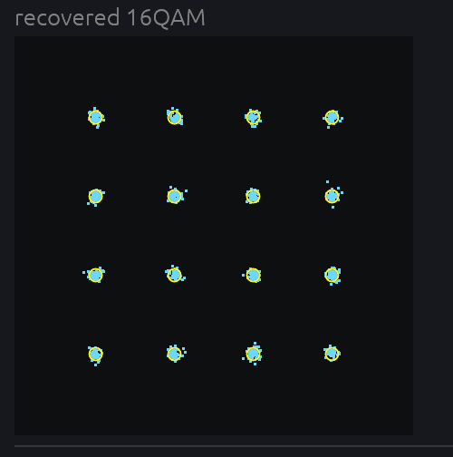

# neowon

[](https://github.com/serjster/neowon/actions/workflows/ci.yml)
[](LICENSE-MIT)

A high-performance oscilloscope **and** software-defined radio in Rust, built
on [Bevy](https://bevy.org) with a GPU digital-phosphor rendering pipeline and
a modular acquisition-backend architecture. One application, two instruments:
the **OWON VDS1022 / VDS1022I** USB oscilloscope and **RTL-SDR** receivers,
each with a deterministic simulated backend for development and testing.


## Install

Prebuilt binaries for Linux, macOS (Intel and Apple Silicon) and Windows are
attached to each [release](https://github.com/serjster/neowon/releases).
Unpack and run `neowon-app`; the archive carries the display-effect shaders,
the SDR++ band plans, the VDS1022 FPGA bitstreams (needed after the
instrument is power-cycled) and, on Linux, the udev rules that make the
devices reachable as a normal user:

```sh
sudo cp 99-vds1022.rules 99-rtlsdr.rules /etc/udev/rules.d/ && sudo udevadm control --reload
```

Or build from source with `cargo build --release`.

## Features

- **SDR mode (RTL-SDR)**: a wideband spectrum and waterfall with an IQ
  constellation, a clean tuning model (**Centre** = the hardware window,
  **Tuned** = the channel you monitor, **Width**, and opt-in **Follow**),
  click-to-tune and drag-a-filter-edge-to-resize, signal detection and
  tracking, a modulation lab (symbol rate, EVM/MER, cumulants, recovered
  constellation), a DSP classifier that says `unknown` when it should, a band
  survey with new/gone/stronger/weaker diffing, and a persistent signal
  catalog. Driven by an in-tree RTL2832U + R82xx driver on `nusb` — no
  libusb — with ppm correction, direct sampling for HF below 24 MHz, and tuner
  AGC.
- **Realtime AM/FM audio**: demodulate the tuned channel (AM, NFM, WFM) to the
  sound card with volume, mute and squelch, from the same streaming DSP that
  feeds the displays; the channel width is set by dragging the filter edges on
  the spectrum.
- **RF reference**: the whole tunable range as a band chart (RF map window,
  minimap, band strip under the spectrum) driven by SDR++-schema band plans —
  21 shipped, plus your own in `~/.neowon/bandplans` — and a known-station
  layer imported from public databases (Wikidata, EiBi, OurAirports, FCC
  `fmq`/`amq`, FMLIST exports), ranked by distance from an opt-in location.
  Click a station to tune it and pick the fitting demodulator; `+ cat` copies
  a row into the catalog with `refdb:<source>:<id>` provenance. The reference
  store (`~/.neowon/refdb`) is separate from the catalog, and nothing is
  fetched unless you ask — no startup or background lookups.
- **GPU digital-phosphor display**: compute-shader rasterization with
  intensity grading, persistence (off → infinite), vectors/dots/XY modes,
  optional CRT styling (phosphor halo, scanlines, vignette), and thermal /
  green-CRT palettes.
- **Full acquisition control**: edge, pulse-width, and slope triggers
  (hardware-verified; video trigger implemented but unverified), Auto /
  Normal / Single sweeps, holdoff, peak-detect, host-side averaging, roll
  mode, auto-set.
- **Measurements**: 18 automatic measurements with running statistics
  (mean/min/max/σ/n), draggable time & amplitude cursors, on-graph
  measurement guides, math channel (+, −, ×, ÷, d/dt, ∫) rendered as a
  first-class trace.
- **FFT spectrum** with six windows, amplitude-correct scaling, and
  zoom/pan.
- **Pass/fail testing** against a captured reference envelope, with the
  MULTI port TTL output.
- **Recording, history & export**: capture the record stream, scrub back
  through it frame by frame (history browser), save/reload lossless
  `.nwc` capture files (zstd), import the vendor app's `.cap` recordings,
  and export as WAV (16-bit PCM at the acquisition rate — an XY capture
  is directly replayable oscilloscope music), CSV, raw i8, or a PNG of
  the display.
- **Reference traces & sessions**: freeze a channel as a ghost trace for
  visual comparison; save/restore the full instrument setup — a session
  file is itself a neowon automation script, readable and editable.
- **Bench-scope horizontal controls**: s/div is the primary time base and
  it drives the sample rate, so zooming out runs from 50 µs/div all the
  way to 200 s/div (the trace rolls, as on a real scope, below
  200 ms/div); horizontal position is the trigger delay; and Zoom
  (delayed sweep) is an explicit magnified window into the acquired
  record, with a band showing which slice you are looking at. Stopping
  acquisition turns the time-base control into a zoom over stored data.
- **Touch-scope interaction on a desktop**: drag the trigger level and
  position, drag traces to move offsets, scroll to change volts/div,
  shift+scroll for the horizontal zoom.
- **Timeline view**: zoom out past what one acquisition holds and the display
  spans recorded history at the *same* sample rate instead of slowing down and
  aliasing the signal away. Time the instrument was not acquiring is drawn as
  a marked gap rather than quietly closed up, with the percentage reported.
- **Protocol decoders**: UART, I²C, SPI and 1-Wire over a separate digitizing
  stage with hysteresis. Below 12 samples per bit they refuse and say why,
  rather than emitting plausible bytes; a mismatched UART baud is reported as
  an unstable bit instead of decoded.
- **Backends beyond the scope**: `--audio` turns the machine's sound card into
  a streaming two-channel input (no record, no hardware trigger, host-side
  triggering), and `--sim` is a deterministic signal generator including real
  UART traffic to decode.
- **Scales to your display**: the window and UI size themselves to the
  monitor, with a manual override for hi-DPI panels the OS does not scale
  (`NEOWON_UI_SCALE`, or the Utility dialog's slider).
- **Comes back the way you left it**: UI scale, window size and position,
  dock sections, open windows, the workspace mode (scope or SDR) and every
  scope and SDR setting are saved to `~/.neowon/state.nws` (a plain session
  script) and restored at launch — the launch flags still pick simulators vs
  hardware. Environment overrides win; `NEOWON_NO_STATE=1` turns it off, and
  scripted runs never touch it.
- **Fully scriptable**: every control is reachable from a plain-text
  automation script (`NEOWON_SCRIPT`), including plot-texture screenshots
  with regions of interest — the same mechanism the test suite uses.
- **Remote control & MCP**: a localhost control socket exposes the whole
  script grammar plus JSON state/measurement queries, and the bundled
  `neowon-mcp` server lets LLM clients (Claude, etc.) drive the scope and
  *see* its display via PNG screenshots.
- **Visualization playground**: realtime waterfall spectrogram, a 3D
  viewport (spectrogram terrain, waveform tunnel, delay-embedding phase
  portrait, XY-vs-time cube) with orbit controls, and **user-loadable
  display shaders** — drop a WGSL file in `assets/shaders/user/`, pick it
  live, hit Reload to iterate (kaleidoscope, signal-driven ripple, and a
  heavy-CRT warp ship as examples).
- **Always-on scrollback**: the capture ring records continuously like a
  terminal's scrollback — pause, scrub back through history, resume;
  oldest frames drop on overflow (~20 min).
- **Virtual testbench**: a deterministic signal engine (sine/square/
  trapezoid/chirp/AM/FM sums, XY figures, WAV playback, simulated
  triggering) verifies every DSP and render path in CI-friendly tests.


*Waterfall + 3D spectrogram terrain + the `crt-warp` user shader on a chirp.*


*A Lissajous figure with history as depth (`viz xytime`).*


*Oscilloscope Quake (`--demo`): E1M1, drawn by an audio waveform in XY mode.*


*SDR mode: wideband spectrum and waterfall, the tuned channel cursor with its
width shaded, the Audio section, the modulation lab's results and the signal
list.*


*The modulation lab recovering a 16-QAM constellation (4.1% EVM, 27.8 dB MER
on the simulator).*

## Hardware

| Instrument | Status |
| --- | --- |
| OWON VDS1022 / VDS1022I | Working, hardware-verified (25 MHz, 2 ch, 100 MS/s) |
| RTL-SDR (RTL2832U + R820T/R828D) | Working, hardware-verified on a V3 dongle: 24 MHz–1.766 GHz, ppm correction, tuner AGC, HF direct sampling below 24 MHz, realtime AM/FM audio |
| OWON VDS2052 | Untested; the driver's register-table design should make it a small port |
| Flipper Zero | Planned (see `PLAN.md`) |

The protocol implementation was ported from the community
[OWON-VDS1022](https://github.com/florentbr/OWON-VDS1022) Python reference
and the decompiled vendor app, then verified against real hardware —
including a few places where this repo's findings *correct* the reference
(see `docs/protocol-vds1022.md`).

## Building

Requires stable Rust (edition 2024; 1.95+).

```sh
cargo build --release
```

- **macOS**: works out of the box (pure-Rust USB via `nusb`; no driver).
- **Linux**: install Bevy's system deps (`libasound2-dev libudev-dev` on
  Debian/Ubuntu) and install the shipped udev rules:

  ```sh
  sudo cp scripts/99-vds1022.rules /etc/udev/rules.d/
  sudo udevadm control --reload   # then replug the scope
  ```

  They grant USB access *and* stop the kernel's `usb_serial_simple` driver
  from claiming the scope's interface (which otherwise makes
  `claim_interface` fail with `EBUSY`). If a session is already wedged:
  `echo <bus>-<port>:1.0 | sudo tee
  /sys/bus/usb/drivers/usb_serial_simple/unbind` (see
  `docs/protocol-vds1022.md`).
- **Linux: RTL-SDR**: the kernel's DVB-T driver claims the dongle, so blacklist
  it, install the rule, then replug:

  ```sh
  echo 'blacklist dvb_usb_rtl28xxu' | sudo tee /etc/modprobe.d/blacklist-rtl.conf
  sudo cp scripts/99-rtlsdr.rules /etc/udev/rules.d/ && sudo udevadm control --reload
  ```
- **Windows**: untested; contributions welcome.

### FPGA bitstreams (hardware only)

The VDS1022 needs an FPGA bitstream uploaded at every cold start. The
OWON bitstreams are vendored in [`3rdparty/fw/`](3rdparty/fw/) (see its
README for provenance — they are OWON's, not covered by this repo's
license), so a repo checkout works out of the box. neowon looks in
`$NEOWON_FPGA_DIR`, `./fwr`, `./3rdparty/fw`, then
`../OWON-VDS1022/fwr`.

## Running

```sh
cargo run --release -p neowon-app               # real scope
cargo run --release -p neowon-app -- --sim      # simulated scope
cargo run --release -p neowon-app -- --rtl      # RTL-SDR dongle
cargo run --release -p neowon-app -- --sdr-sim  # simulated SDR (no hardware)
cargo run --release -p neowon-app -- --demo     # Oscilloscope Quake (see below)
```

Only one process may use the scope at a time — close the vendor app first.
The Instrument menu (or the `instrument scope|sdr` script action) switches
between the two at run time within the launch's family: the simulators swap
for each other, and the VDS1022 swaps for the RTL-SDR.

### SDR

The SDR workspace puts the spectrum over the waterfall, with the **tuned
cursor** and its channel **Width** shaded around it. *Left-click* tunes,
*left-drag a filter edge* resizes the width, *left-drag* pans, *right-drag*
moves the hardware window, *scroll* zooms the span. The dock holds the tune
controls, detection, the modulation lab, and the **Audio** section
(demodulator, volume, mute, squelch, and a state line that names every silent
state). Detected signals can be filed into a persistent **catalog** that
survives restarts.

It is fully scriptable like the scope, e.g.:

```sh
sdr tune 99.4M        # tune the channel cursor (the window moves only if 99.4M is outside it)
sdr centre 99M        # move the hardware window
sdr width auto        # channel width from the nearest detection
sdr demod wfm         # realtime audio; am | nfm | wfm | off
sdr survey 88M 108M   # band survey; `get surveydiff` for what changed
catalog add           # file the tuned channel
```

`get sdr | audio | detections | modmeas | classify | survey | catalog` return
structured JSON over the control socket, and the MCP server exposes the same
as tools (`sdr_tune`, `sdr_demod`, `sdr_audio`, `catalog`, …).

### The Quake demo

`--demo` plays back the *Oscilloscope Quake* stereo WAVs from
[lofibucket.com](https://www.lofibucket.com/articles/oscilloscope_quake.html)
in XY mode (left = X, right = Y) on a green CRT. Fetch the files first:

```sh
scripts/fetch-demo.sh
```

### Headless CLI

```sh
cargo run -p neowon-cli --                    # `neowon` binary
  probe | dump | stream | smoke | autoset
```

`neowon smoke` verifies the whole stack against the scope's own 1 kHz
probe-compensation signal.

### Scripting

Set `NEOWON_SCRIPT=path.txt` to drive the app from a plain-text action list
(stimulus selection, every control, screenshots, exports…). The full
grammar is documented at the top of `crates/neowon-app/src/script.rs`.

### Remote control & MCP

Set `NEOWON_CONTROL=<port>` and the app serves a line-oriented control
API on `127.0.0.1:<port>`: any script action per line (acked with JSON),
plus `get status` / `get config` / `get measure` queries returning
structured JSON. Every external transport builds on this.

`neowon-mcp` is an [MCP](https://modelcontextprotocol.io) stdio server
over that socket, so an LLM client (Claude Code, Claude Desktop, …) can
drive the scope: configure channels/triggers, read the 18 automatic
measurements with statistics, run any script action, and take PNG
screenshots of the display **returned as images the model can see**.

```sh
# zero-setup demo: the server spawns the simulator itself
claude mcp add neowon -- ./target/release/neowon-mcp --spawn-sim

# or attach to a running app (real hardware or sim)
NEOWON_CONTROL=7777 cargo run --release -p neowon-app &
claude mcp add neowon -- ./target/release/neowon-mcp --connect 127.0.0.1:7777
```

## Testing

Everything below the first line needs a GPU and a window, so those suites are
`#[ignore]`d and opted into explicitly. All of them run against the simulator;
none touch the instrument.

```sh
cargo test                                        # unit + virtual testbench
cargo test -p neowon-app --test shaders           # naga-validate all WGSL
cargo test -p neowon-dsp --test demod_golden      # AM/NFM/WFM against exact sim signals
```

The rest, each with `-p neowon-app -- --ignored`:

| Suite | What it would catch |
| --- | --- |
| `accuracy` | scaling bugs, via invariance: the same signal measured through different time bases and volts/div must give the same answer. A frequency that moves when you change the time base looks perfectly fine on screen, which is why it needs a test rather than an eye |
| `ui_geometry` | chrome overlapping the waveform grid, swept over a window-size × UI-scale matrix from 1520×820 to 2688×1512 at scales 1.0–2.0, with each dock section opened in turn |
| `ui_layout` | layout invariants (region ordering, no zero-size regions) |
| `ui_pixels` | the render path: what actually reaches the framebuffer |
| `effects_pixels` | user display-effect shaders still composite correctly |
| `view_controls` | zoom, pan and time base behaving as the horizontal model says |
| `deep_view` | the timeline's whole reason to exist: spanning more time than one record holds *without* dropping the sample rate, plus gap accounting and follow-mode stability |
| `decode_flow` | protocol decoders end to end, from stimulus to decoded bytes |
| `capture_flows` | capture save/reload and session round trips |
| `sdr_mode` | the simulated SDR end to end: tuning, spectrum/waterfall, detection, and a deterministic IQ fingerprint |
| `sdr_integration` | scope ↔ SDR switch and the tune → detect → analyse → classify → catalog → export chain |
| `sdr_modlab` | the modulation lab recovering QPSK/16QAM and matching closed-form EVM |
| `sdr_survey` | a band survey and its new/gone/stronger/weaker diff |
| `sdr_audio` | the AM demodulator and the audio state machine (plays audio) |
| `catalog_flow` | the signal catalog across an app restart |

```sh
cargo test -p neowon-mcp --test mcp_e2e -- --ignored   # MCP end-to-end
cargo run -p neowon-vds1022 --example trigtest         # trigger matrix (NEEDS HARDWARE)
```

## Releasing

CI builds and tests every push. Publishing is deliberate: push a tag and the
release workflow builds Linux, macOS (Intel and Apple Silicon) and Windows,
packages each with the shaders, band plans, bitstreams, licences and udev
rules, and attaches them to a GitHub release.

```sh
git tag -a v0.2.1 -m "v0.2.1" && git push origin v0.2.1
```

Run the same workflow from the Actions tab (`workflow_dispatch`) to build and
inspect the archives without publishing anything.

## Repository layout

| Crate | Role |
| --- | --- |
| `neowon-core` | Engine-free shared types, WAV I/O |
| `neowon-backend` | Backend trait, config model, supervisor thread |
| `neowon-sim` | Deterministic signal engine / virtual testbench source |
| `neowon-vds1022` | VDS1022 USB driver (nusb), protocol constants |
| `neowon-sdr` | RTL2832U + R82xx USB driver (nusb), survey engine |
| `neowon-catalog` | Persistent signal/source catalog (WAL, merge, history) |
| `neowon-audio` | Sound-card streaming input backend and audio output sink |
| `neowon-dsp` | Measurements, statistics, FFT, math, demodulators — the CPU oracle |
| `neowon-cli` | Headless bring-up and debugging tool |
| `neowon-app` | Bevy application: GPU pipeline, UI, scripting, control socket |
| `neowon-mcp` | MCP server exposing the running instrument to LLM clients |

`PLAN.md` holds the roadmap and phase status. `docs/protocol-vds1022.md` and
`docs/protocol-rtlsdr.md` record every hardware-verified protocol fact;
`docs/sdr-feature-catalog.md` is the research behind the SDR program.

## Contributing

See [CONTRIBUTING.md](CONTRIBUTING.md).

## License

Licensed under either of [Apache License 2.0](LICENSE-APACHE) or
[MIT license](LICENSE-MIT) at your option. The demo WAVs and FPGA
bitstreams are third-party content and are not covered.
