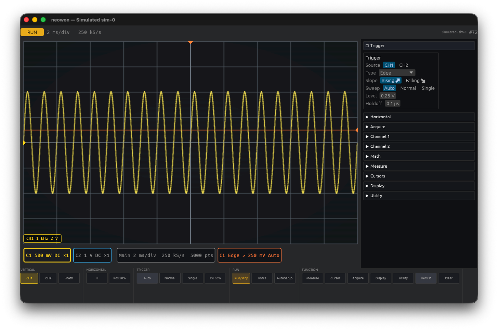
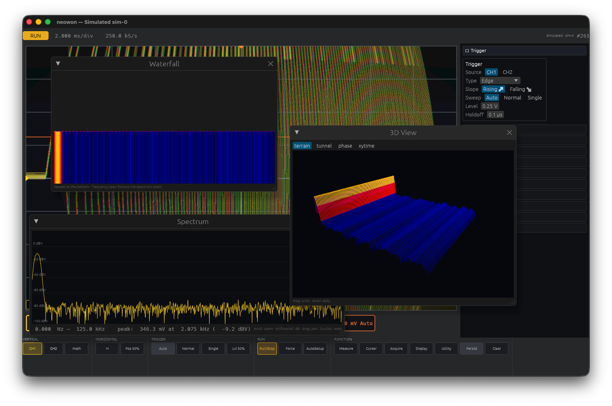
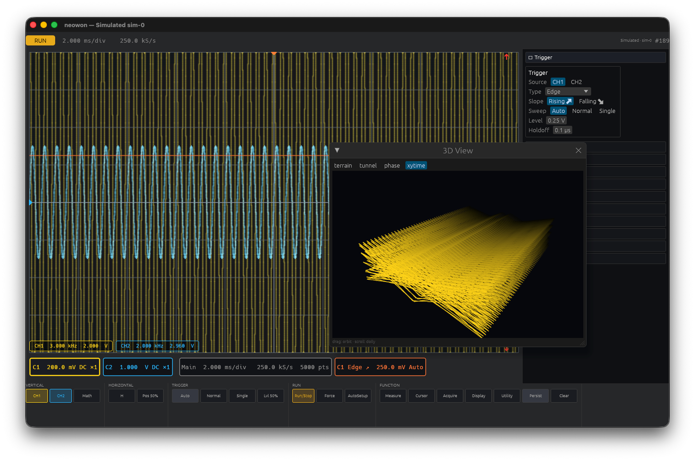
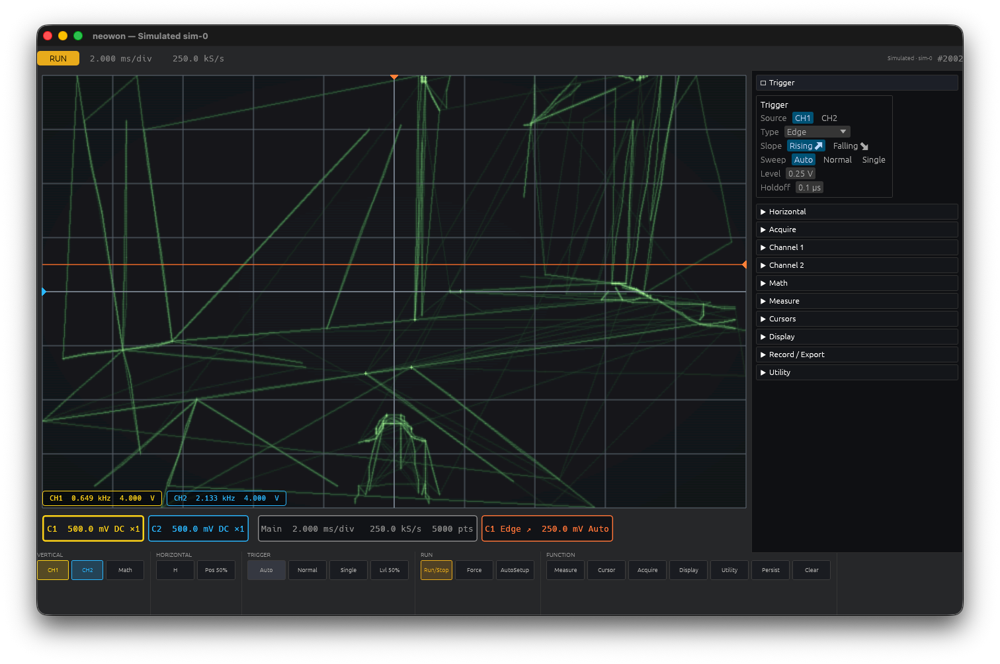

# neowon

[](https://github.com/serjster/neowon/actions/workflows/ci.yml)
[](LICENSE-MIT)

A high-performance, scope-grade oscilloscope application in Rust, built on
[Bevy](https://bevy.org) with a GPU digital-phosphor rendering pipeline and a
modular acquisition-backend architecture. The first supported instrument is
the **OWON VDS1022 / VDS1022I** USB oscilloscope, with a deterministic
simulated backend for development and testing; SDR and other sources are on
the roadmap.



## Features

- **GPU digital-phosphor display**: compute-shader rasterization with
  intensity grading, persistence (off → infinite), vectors/dots/XY modes,
  optional CRT styling (phosphor halo, scanlines, vignette), and thermal /
  green-CRT palettes.
- **Full acquisition control**: edge, pulse-width, and slope triggers
  (hardware-verified; video trigger implemented but unverified), Auto /
  Normal / Single sweeps, holdoff, peak-detect, host-side averaging, roll
  mode, auto-set.
- **Measurements**: 18 automatic measurements with running statistics
  (mean/min/max/σ/n), draggable time & amplitude cursors, on-graph
  measurement guides, math channel (+, −, ×, ÷, d/dt, ∫) rendered as a
  first-class trace.
- **FFT spectrum** with six windows, amplitude-correct scaling, and
  zoom/pan.
- **Pass/fail testing** against a captured reference envelope, with the
  MULTI port TTL output.
- **Recording, history & export**: capture the record stream, scrub back
  through it frame by frame (history browser), save/reload lossless
  `.nwc` capture files (zstd), import the vendor app's `.cap` recordings,
  and export as WAV (16-bit PCM at the acquisition rate — an XY capture
  is directly replayable oscilloscope music), CSV, raw i8, or a PNG of
  the display.
- **Reference traces & sessions**: freeze a channel as a ghost trace for
  visual comparison; save/restore the full instrument setup — a session
  file is itself a neowon automation script, readable and editable.
- **Bench-scope horizontal controls**: s/div is the primary time base and
  it drives the sample rate, so zooming out runs from 50 µs/div all the
  way to 200 s/div (the trace rolls, as on a real scope, below
  200 ms/div); horizontal position is the trigger delay; and Zoom
  (delayed sweep) is an explicit magnified window into the acquired
  record, with a band showing which slice you are looking at. Stopping
  acquisition turns the time-base control into a zoom over stored data.
- **Touch-scope interaction on a desktop**: drag the trigger level and
  position, drag traces to move offsets, scroll to change volts/div,
  shift+scroll for the horizontal zoom.
- **Scales to your display**: the window and UI size themselves to the
  monitor, with a manual override for hi-DPI panels the OS does not scale
  (`NEOWON_UI_SCALE`, or the Utility dialog's slider).
- **Fully scriptable**: every control is reachable from a plain-text
  automation script (`NEOWON_SCRIPT`), including plot-texture screenshots
  with regions of interest — the same mechanism the test suite uses.
- **Remote control & MCP**: a localhost control socket exposes the whole
  script grammar plus JSON state/measurement queries, and the bundled
  `neowon-mcp` server lets LLM clients (Claude, etc.) drive the scope and
  *see* its display via PNG screenshots.
- **Visualization playground**: realtime waterfall spectrogram, a 3D
  viewport (spectrogram terrain, waveform tunnel, delay-embedding phase
  portrait, XY-vs-time cube) with orbit controls, and **user-loadable
  display shaders** — drop a WGSL file in `assets/shaders/user/`, pick it
  live, hit Reload to iterate (kaleidoscope, signal-driven ripple, and a
  heavy-CRT warp ship as examples).
- **Always-on scrollback**: the capture ring records continuously like a
  terminal's scrollback — pause, scrub back through history, resume;
  oldest frames drop on overflow (~20 min).
- **Virtual testbench**: a deterministic signal engine (sine/square/
  trapezoid/chirp/AM/FM sums, XY figures, WAV playback, simulated
  triggering) verifies every DSP and render path in CI-friendly tests.


*Waterfall + 3D spectrogram terrain + the `crt-warp` user shader on a chirp.*


*A Lissajous figure with history as depth (`viz xytime`).*


*Oscilloscope Quake (`--demo`): E1M1, drawn by an audio waveform in XY mode.*

## Hardware

| Instrument | Status |
| --- | --- |
| OWON VDS1022 / VDS1022I | Working, hardware-verified (25 MHz, 2 ch, 100 MS/s) |
| OWON VDS2052 | Untested; the driver's register-table design should make it a small port |
| RTL-SDR, Flipper Zero | Planned (see `PLAN.md`) |

The protocol implementation was ported from the community
[OWON-VDS1022](https://github.com/florentbr/OWON-VDS1022) Python reference
and the decompiled vendor app, then verified against real hardware —
including a few places where this repo's findings *correct* the reference
(see `docs/protocol-vds1022.md`).

## Building

Requires stable Rust (edition 2024; 1.95+).

```sh
cargo build --release
```

- **macOS**: works out of the box (pure-Rust USB via `nusb`; no driver).
- **Linux**: install Bevy's system deps (`libasound2-dev libudev-dev` on
  Debian/Ubuntu) and install the shipped udev rules:

  ```sh
  sudo cp scripts/99-vds1022.rules /etc/udev/rules.d/
  sudo udevadm control --reload   # then replug the scope
  ```

  They grant USB access *and* stop the kernel's `usb_serial_simple` driver
  from claiming the scope's interface (which otherwise makes
  `claim_interface` fail with `EBUSY`). If a session is already wedged:
  `echo <bus>-<port>:1.0 | sudo tee
  /sys/bus/usb/drivers/usb_serial_simple/unbind` (see
  `docs/protocol-vds1022.md`).
- **Windows**: untested; contributions welcome.

### FPGA bitstreams (hardware only)

The VDS1022 needs an FPGA bitstream uploaded at every cold start. The
OWON bitstreams are vendored in [`3rdparty/fw/`](3rdparty/fw/) (see its
README for provenance — they are OWON's, not covered by this repo's
license), so a repo checkout works out of the box. neowon looks in
`$NEOWON_FPGA_DIR`, `./fwr`, `./3rdparty/fw`, then
`../OWON-VDS1022/fwr`.

## Running

```sh
cargo run --release -p neowon-app            # real hardware
cargo run --release -p neowon-app -- --sim   # simulated backend
cargo run --release -p neowon-app -- --demo  # Oscilloscope Quake (see below)
```

Only one process may use the scope at a time — close the vendor app first.

### The Quake demo

`--demo` plays back the *Oscilloscope Quake* stereo WAVs from
[lofibucket.com](https://www.lofibucket.com/articles/oscilloscope_quake.html)
in XY mode (left = X, right = Y) on a green CRT. Fetch the files first:

```sh
scripts/fetch-demo.sh
```

### Headless CLI

```sh
cargo run -p neowon-cli --                    # `neowon` binary
  probe | dump | stream | smoke | autoset
```

`neowon smoke` verifies the whole stack against the scope's own 1 kHz
probe-compensation signal.

### Scripting

Set `NEOWON_SCRIPT=path.txt` to drive the app from a plain-text action list
(stimulus selection, every control, screenshots, exports…). The full
grammar is documented at the top of `crates/neowon-app/src/script.rs`.

### Remote control & MCP

Set `NEOWON_CONTROL=<port>` and the app serves a line-oriented control
API on `127.0.0.1:<port>`: any script action per line (acked with JSON),
plus `get status` / `get config` / `get measure` queries returning
structured JSON. Every external transport builds on this.

`neowon-mcp` is an [MCP](https://modelcontextprotocol.io) stdio server
over that socket, so an LLM client (Claude Code, Claude Desktop, …) can
drive the scope: configure channels/triggers, read the 18 automatic
measurements with statistics, run any script action, and take PNG
screenshots of the display **returned as images the model can see**.

```sh
# zero-setup demo: the server spawns the simulator itself
claude mcp add neowon -- ./target/release/neowon-mcp --spawn-sim

# or attach to a running app (real hardware or sim)
NEOWON_CONTROL=7777 cargo run --release -p neowon-app &
claude mcp add neowon -- ./target/release/neowon-mcp --connect 127.0.0.1:7777
```

## Testing

```sh
cargo test                                        # unit + virtual testbench
cargo test -p neowon-app --test ui_pixels  -- --ignored  # render geometry (opens a window)
cargo test -p neowon-app --test ui_layout  -- --ignored  # layout invariants
cargo test -p neowon-app --test capture_flows  -- --ignored  # capture/session flows
cargo test -p neowon-mcp --test mcp_e2e       -- --ignored  # MCP end-to-end
cargo run -p neowon-vds1022 --example trigtest    # trigger matrix (needs hardware)
cargo test -p neowon-app --test shaders           # naga-validate all WGSL
```

## Repository layout

| Crate | Role |
| --- | --- |
| `neowon-core` | Engine-free shared types, WAV I/O |
| `neowon-backend` | Backend trait, config model, supervisor thread |
| `neowon-sim` | Deterministic signal engine / virtual testbench source |
| `neowon-vds1022` | VDS1022 USB driver (nusb), protocol constants |
| `neowon-dsp` | Measurements, statistics, FFT, math — the CPU oracle |
| `neowon-cli` | Headless bring-up and debugging tool |
| `neowon-app` | Bevy application: GPU pipeline, UI, scripting, control socket |
| `neowon-mcp` | MCP server exposing the running scope to LLM clients |

`PLAN.md` holds the roadmap and phase status;
`docs/protocol-vds1022.md` records every hardware-verified protocol fact.

## Contributing

See [CONTRIBUTING.md](CONTRIBUTING.md).

## License

Licensed under either of [Apache License 2.0](LICENSE-APACHE) or
[MIT license](LICENSE-MIT) at your option. The demo WAVs and FPGA
bitstreams are third-party content and are not covered.
